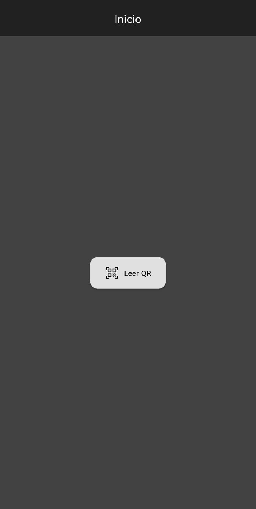
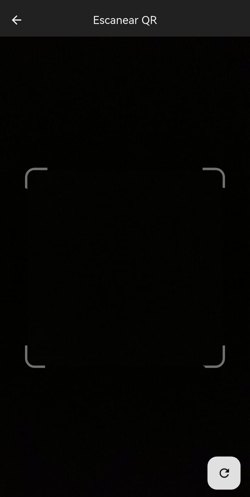

# QuickQR

> A sleek, cross-platform Flutter QR code reader with Material Design 3 in monochrome.

[](https://flutter.dev) [](LICENSE) [](https://drive.google.com/file/d/1aWjIVt-4Iya9hJALAhKQaf13L_KLnTsz/view?usp=sharing)

---

## 🔍 Overview

**QuickQR** is a minimalist QR scanning application built with **Flutter** and **Material Design 3**, featuring a monochromatic grayscale theme. It scans QR codes in real time using the device camera and handles content intelligently:

* Opens **URLs** directly in the external browser.
* Displays **plain text** within the app when the QR is not a URL.
* Supports both **light** and **dark** modes in pure gray tones.

---

## 📦 Download

Get the Android APK for QuickQR:

👉 [Download QuickQR APK](https://drive.google.com/file/d/1aWjIVt-4Iya9hJALAhKQaf13L_KLnTsz/view?usp=sharing)

---

## ✨ Key Features

* 🏠 **Home Screen** with a styled MD3 button to start scanning.
* 📷 **Real-time camera scanning** via `qr_code_scanner_plus`.
* 🌐 **Intelligent content handling**: URLs vs. text.
* 🎨 **Monochrome UI**: gray-only palette for all components.
* 🌙 **Dark & Light Mode** support following system settings.

---

## 📁 Repository Structure

```
my_qr_reader_app/
├─ android/           # Native Android config & permissions
├─ ios/               # Native iOS config & permissions
├─ lib/
│  ├─ app.dart        # App entry & route setup
│  ├─ main.dart       # Flutter runApp()
│  ├─ theme/          # MD3 grayscale themes & components
│  ├─ screens/        # UI screens (Home, Scan, URL/Text result)
│  ├─ widgets/        # Custom MD3 widgets
│  ├─ services/       # QR scanning logic
│  └─ utils/          # Navigation & constants
├─ pubspec.yaml       # Dependencies & assets
└─ README.md          # Project overview
```

---

## 🚀 Getting Started

1. **Clone the repo**

   ```bash
   git clone https://github.com/Jumaikel/qr_scanner.git
   cd qr_scanner
   ```

2. **Install dependencies**

   ```bash
   flutter pub get
   ```

3. **Run on your device/emulator**

   ```bash
   flutter run
   ```

---

## 🔧 Dependencies

| Package                | Purpose                       |
| ---------------------- | ----------------------------- |
| `qr_code_scanner_plus` | Camera-based QR scanning      |
| `url_launcher`         | Open URLs in external browser |
| `permission_handler`   | Manage camera permissions     |

---

## 🎨 Theming

* **Material Design 3** with a custom grayscale `ColorScheme`.
* Both **light** and **dark** themes defined in `lib/theme/app_theme.dart`.

---

## 📸 Screenshots

|          Home Screen          |          Scan Screen          |           Result Screen           |
| :---------------------------: | :---------------------------: | :-------------------------------: |
|  |  |  |

---

## 🤝 Contributing

1. Fork the repository
2. Create a feature branch (`git checkout -b feat/YourFeature`)
3. Commit your changes (`git commit -m 'Add YourFeature'`)
4. Push to the branch (`git push origin feat/YourFeature`)
5. Open a Pull Request

---

## 📜 License

This project is licensed under the [MIT License](LICENSE).
